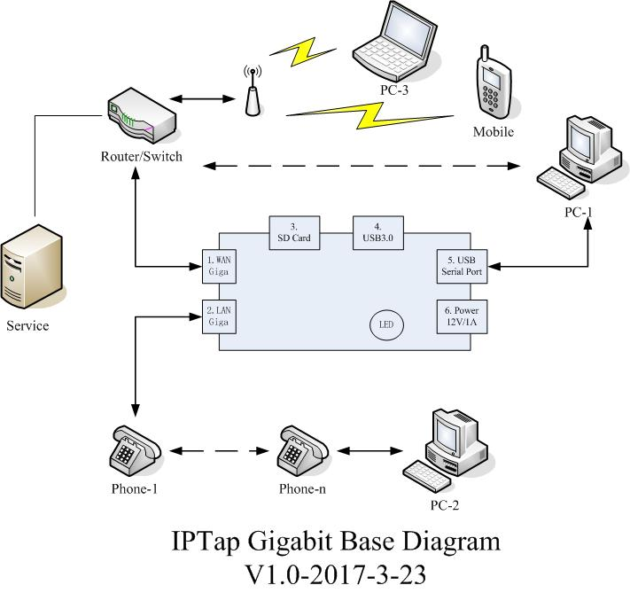

# ipRec-Giga-base
---
title: "ipRec-Giga-Base"
author: "huang kongjun"
date: "2017年3月23日"
output:
  word_document: default
  html_document: default
---

## ipRec-Giga-Base working.

ipRec-Giga-Base dragram see follow. It can working more mode. base mode, web mode, service mode ...

## Speaking.

It this mode. We can working similar old IPTap. but they are different.

#### Diff

1. Gigabit Ethernet's port are not High impedance in ipRec-Giga. It's not isolated from the network. Actually, It working switch mode. It's is a small switch device.
2. ipRec-Giga need a high power over 5V. So, We can not use 5V usb power. So, we need a alone supply power.
3. It's need a continue supply power for network working. if no power, network will stop. IP Phone or PC will no network.
4. It's has not a fast USB port connecto PC. Becase ipRec-Giga have USB-host USB's ports. But It's not USB's client's port. So, PC can not directly connnect to ipRec-Giga via USB default. if we hope to use PC's USB connect to ipRec-Giga. I will add a usb-serial adapter. So, PC can connect to ipRec-Giga. But It's speed slowly.
5. ipRec-giga is a alone Recorder. It's similar to a PC. it's can record ethernet data and save to SD card, USB-Stick, or transmit to file to a remote file server.
6. ipRec-Giga can work a simple file server. etc, tftp server, web server, etc. Because It's run a small linux OS.

#### Working

*see follow dragram*

1. PC1 directly connect to ipRec-Giga via USB cable. PC-1 can send/get ipRec-Giga config information. Let ipRec-Giga working arrange config information. config infromation `ipRec-giga\'s IP address, ipPhone filter, etc...`.
2. I don't suggest PC-1 get record file via USB connecter. Beause This USB is slowly speed. If transimt file need a long time. If you can do this if you allow wait for a long time.
3. we can running IRL-recording's host softwore to control ipRec-Giga. I can add these function in ipRec-Giga.
4. I suggest PC-1 connect to ipRec-Giga via ethernet. It's fast speed. We can get/send data to ipRec-Giga. So, We can do many control. I think it's good.
5. I think many ethernet device can contorl the ipRec-Giga. `PC-1, PC-2, PC-3, Mobile etc.`
6. Every ipRec-Giga has a ID. We can use ID to know which's device.
7. ipRec-Giga can save record file and config file to remote server via network. It's can run tft, ssh, etc file server soft.
8. ipRec-giga can make a small file server. network device can visit ipRec-Giga via network.

I speak some functions in the feature. I believe it will be a great project. Because technology of intelligent devices progress is too fast.

 

