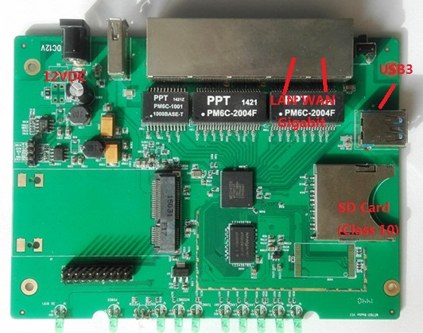
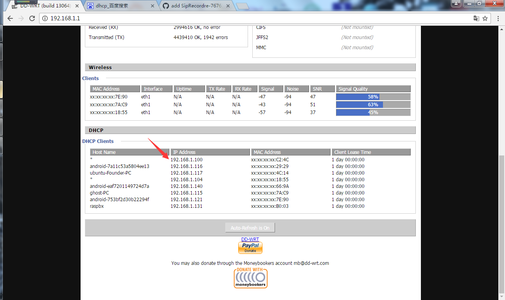
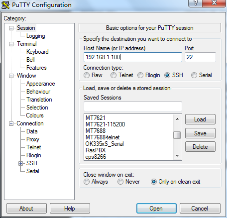
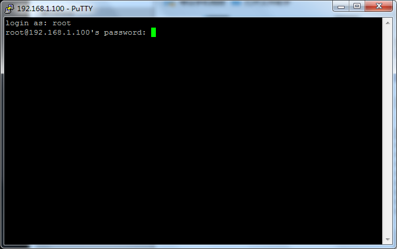

# ipRec-Giga-Sample-manual
---
title: "ipRec-Giga-Sample-manual"
author: "huang kongjun"
date: "2017年3月21日"
output:
  word_document: default
  html_document: default
---


## Request

#### Hardware

* ipRec-Giga sample
* 2-Gigabit Ethernet cable
* 1-12VDC/1A supply power.
* Router/Switch
* usb stick/sd card

#### Software

* Windowns OS
* PUTTY.exe
* Router/Switch enable DHCP function.

## Using

#### Start

1. connect WAN to router and LAN connector IP Phone or PC.
2. power on



3. ipRec-giga auto get a local IP Address. we can find this ip via router/switch.



4. run PUTTY.exe. (you can download from <http://www.putty.org/>)

    * "Host Name" - ipRec-Giga's IP Address
    * Port -  22
    * Connection Type - SSH
    * Open

    
 


5. enter usename(root) and password(123456).



6. enter ipRec shell.


#### update the latest sipRecorder

1. use git tools clone the latest sipRecorder software.
```
git clone https://github.com/ipRec/sipRecorder.git
```
2. copy `package/packages/sipRecorder_0.1.2-1_ramips_1004kc.ipk` to usb-stick/sd card.
3. plug usb-stick/sd card.
4. install the latest sipRecorder use follow command.

usb-stick

```
root@ipRec:/# opkg /Media/USB-A1/sipRecorder_0.1.2-1_ramips_1004kc.ipk
```

#### run sipRecorder.

```
root@ipRec:/# sipRecorder -i br-br0 &
```

So, sipRecorder start working. we can call phone, and sipRecorder will record phone. we can view recorder log and record files view web.

#### view record file

if IPPhone call, sipRecorder can record vioce to ipRec RAM. we can view record file using browser (IE, Chrome etc).

press `ip:81/spool/ipRec/` in browser, can see recorder's files.

example:

```
192.168.1.100:81/spool/ipRec/
```


